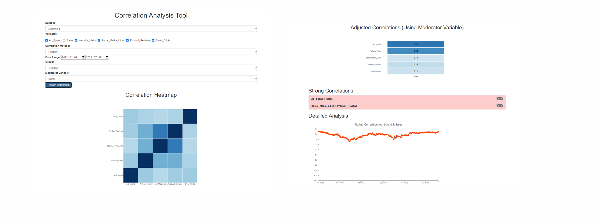

## 광고 및 금융 데이터를 활용한 시각적 분석

## 상관 분석이란?
- 상관 분석
    - 두 변수간의 관계를 분석하는 통계적 방법
    - 한 변수의 변화가 다른 변수에 어떻게 영향을 미치는지 파악
    - 상관계수의 절댓값이 클수록 강한 상관성을 의미

- 상관계수 측정 방법
    - 피어슨 상관계수: 연속형 데이터의 선형 관계 측정
    - 스피어만 상관계수: 순서형 데이터 또는 비선형 관계 측정
    - 켄달의 타우: 순위 데이터 간 상관성 분석

## 광고 및 금융 데이터 시각적 분석 실습
1. 금융데이터에 대해 모든 변수에 대한 상관관계 시각화
2. Stock A와 B 및 채권 수익률 (Bond_Yield)간의 강한 상관관계 발견
3. “전체 기간에 대해서 채권 수익률과의 상관성이 지속적으로 유지되는가?” 라는 질문 생성
4. 추가적인 데이터 분석에 대한 전략 수립 (이동 상관관계 분석)
5. 이동 상관관계 분석 결과 특정 날짜에 상관성이 급격히 하락한 것을 확인
6. 질문에 대한 응답 생성 및 추가 전략 수립
    - 데이터 분포 및 이상치 탐지
    - 이벤트 기반 분석 (뉴스, 경제 이벤트 등)

## 결과
